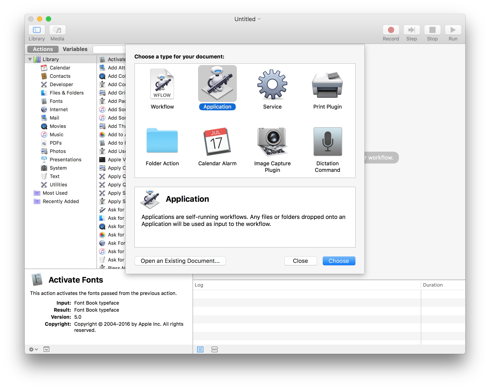
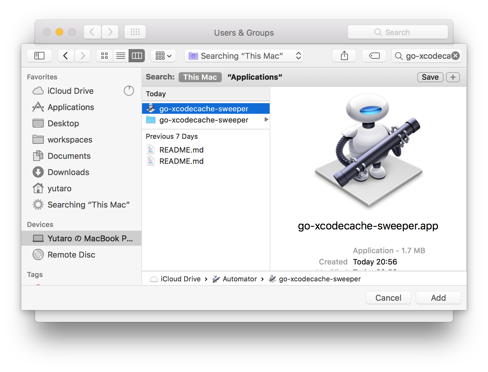

# go-xccache-sweeper

# How to use

## Builde main file

```bash
$go build main.go
```

## Execute app

```bash
$./main
```

## Use with Automator (Recommend)

1. Launch to Automator
2. Choose a type of Application  
    
3. Select `Run Shell Script`
4. Wirte a Shell command
    ```bash
    ~/go/src/github.com/yutailang0119/go-xccache-sweeper/main // WorkingDirectory/go-xccache-sweeper/main
    ```
    
5. Save as Application  
    
6. `System Preference > Users & Groups > Login Items`  
    
7. Select this app

